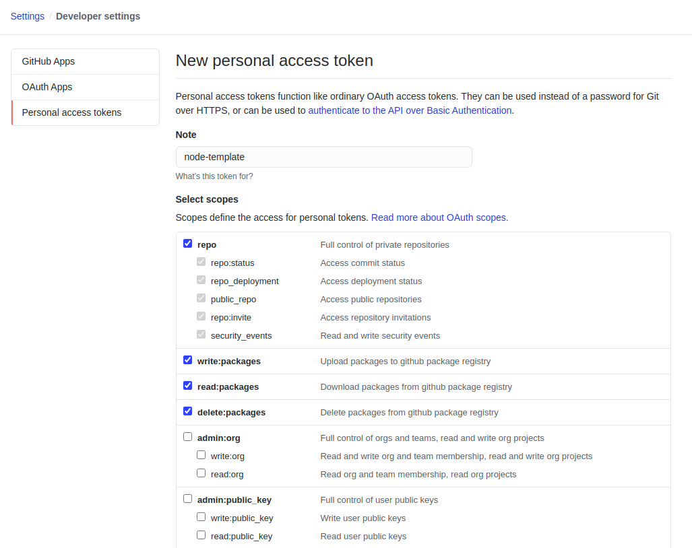

<div>
  
  
</div>

# node-template
Minimum boilerplate template for front-end applications built with node

## Getting Started
1. Clone this repository and install the node dependecies with:
    ```
    npm install
    ```
2. Set up environment variables (accepts `.env` file)
    ```
    NODE_ENV=development
    PORT=3000 // Also defaults to port 3000 if unset
    ```
3. Run development server with:
    ```
    npm run dev
    ```

## Testing
### GitHub Actions
1. In the `package.json` file, enter your the name of your repository
    ```
    {
      ...
      "name": "<repository_name>",
      ...
    }
    ```
2. Enter the appropriate values to the configuration file under `.github/workflows/test.yml`

## Packaging
### Configuration
* Make sure that you have updated the package corresponding values in the `package.json` file.
  ```
  {
    "author": "<github_username>",
    "bugs": {
      "url": "https://github.com/<github_username>/<github_repository>/issues"
    },
    "description": "<repository_description>",
    "homepage": "https://github.com/<github_username>/<github_repository>#readme",
    "name": "<repository_name>",
    "repository": {
      "type": "git",
      "url": "git+https://github.com/<github_username>/<github_repository>.git"
    },
    ...
  }
  ```
  **Note:** The `name` parameter is how npm will reference your package when installing.

### Registry
* Default
  Login to [npmjs.org](https://www.npmjs.com/) with your credentials when prompted with the command:
   ```
   npm login
   ```

* GitHub Package Registry

  **Note:** The `name` parameter for the GitHub's package registry will need to be scoped (i.e. `'@username/package_name'`)
  1. Add the key value pair to `package.json` to configure registry to GitHub
      ```
      "publishConfig": {
        "registry": "https://npm.pkg.github.com/"
      },
      ```
      * Defaults to https://registry.npmjs.org/ public registry if unset

  2. Follow the instructions [here](https://help.github.com/en/github/authenticating-to-github/creating-a-personal-access-token) to create a personal access token for command line login
     * Make sure to select the correct scopes such as `write:packages` and `read:packages` for the token
      
  3. Login to npm within your command line interface with the command:
      ```
      npm login --registry=https://npm.pkg.github.com/
      ```
    

### Publishing
* Once you have logged in and updated the `package.json` values, you can publish your package with:

  ```
  npm publish
  ```
  * This command will run `prepublishOnly` script and then publish to npm afterwards.

### Updating
1. Update the source files as you would and create and push out a commit for these changes.
2. Once you have pushed those changes and you branch is up to date, you can update your package version with the following commands:
    * Patch Release (1.0.1 -> 1.0.2):
      ```
      npm version patch
      ```
    * Minor Release (1.1.0 -> 1.2.0):
      ```
      npm version minor
      ```
    * Major Release (1.0.0 -> 2.0.0):
      ```
      npm version major
      ```
    Note: Running these commands will also create a new commit

3. After updating the package version, publish these updates with:
      ```
      npm publish
      ```

## Backends
### Seperate Local (i.e. Flask, Django, etc.)
1. The frontend and backend repositories should share the same parent directory
    * Set output directory for backend in `app.json` under `local.output.path`
      ```
      {
        "local": {
          "output": {
            "path": "../backend-repository/static"
          }
        }
      } 
      ```
    * Folder structure should look something like this:
      ```
      GitHub
      ├── backend-repository
      └── frontend-repository
      ```
2. After updating those configurations, run  to build with webpack and watch for changes with:
    ```
    npm run build-local-watch
    ```
    * Build the webpack bundle to the same directory **without** watching for changes with 
      ```
      npm run build-local
      ```

3. You may need to reload bundle updates with a hard refresh <kbd>command</kbd> / <kbd>Ctrl</kbd> + <kbd>shift</kbd> + <kbd>R</kbd> to load changes.
    * Webpack will continue to watch for changes, but you will typically need to hard refresh the browser to tell the server to send the updated bundle file.
